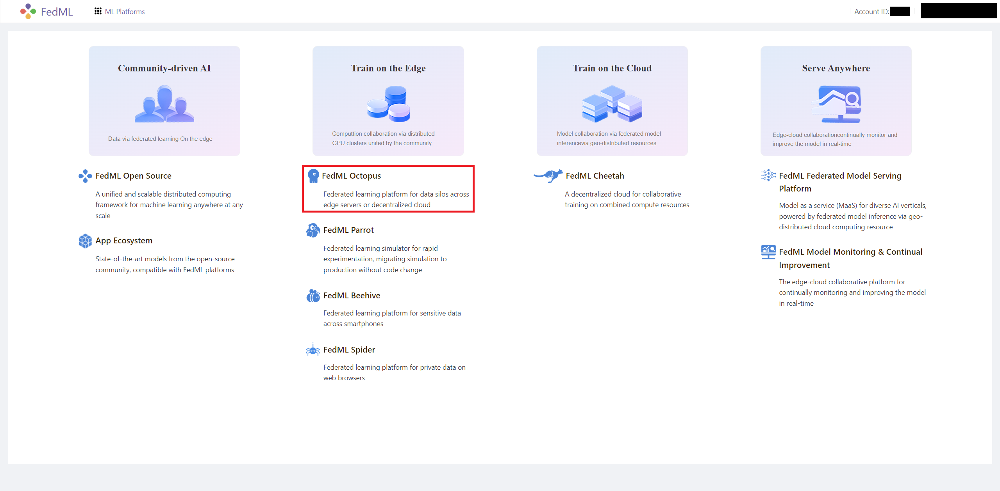
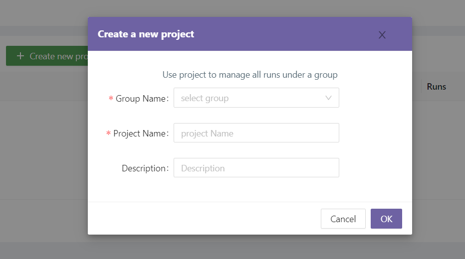
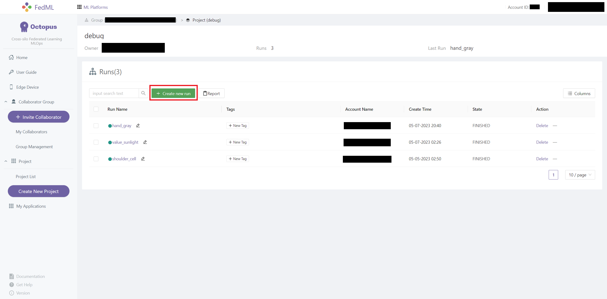
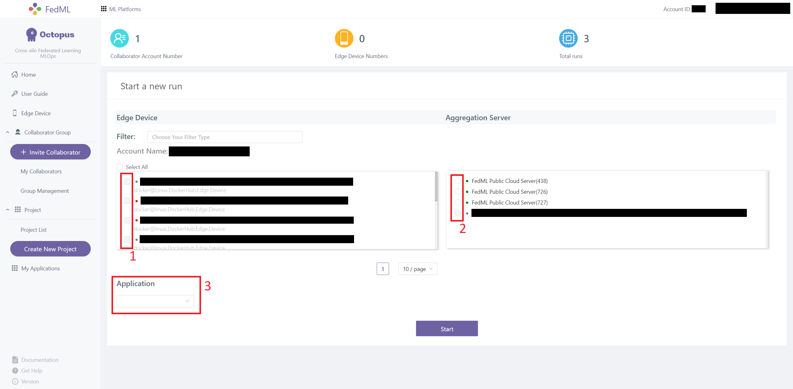
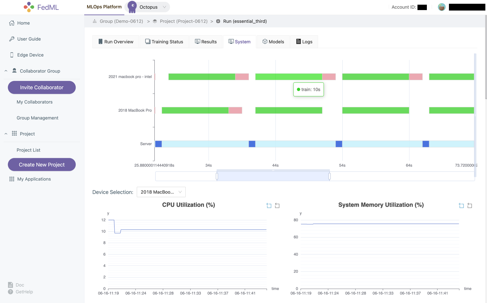

<div align="center">
 
</div>

# FedLLM: Build Your Own Large Language Models on Proprietary Data using the FedML Platform

[FedLLM](https://blog.fedml.ai/releasing-fedllm-build-your-own-large-language-models-on-proprietary-data-using-the-fedml-platform/)
is an MLOps-supported training pipeline to help users build their own large language model (LLM) on proprietary/private
data.
This repo aims to provide a minimalist example of efficient LLM training/fine-tuning
and to illustrate how to use FedML for federated LLM training and fine-tuning.
We leverage Pythia 7B by default and recently added support for Llama 2.

The repo contains:

- A minimalist PyTorch implementation for conventional/centralized LLM training, fine-tuning, and evaluation.
    - The training and evaluation logic
      follows [transformers.Trainer](https://huggingface.co/docs/transformers/main_classes/trainer).
    - LoRA integration from [peft](https://github.com/huggingface/peft).
    - Supports [DeepSpeed](https://www.deepspeed.ai/).
    - Dataset implementation with [datasets](https://huggingface.co/docs/datasets/index).
- Cross-silo Federated training/fine-tuning implementation with [FedML](https://github.com/FedML-AI/FedML).

## News

* __[2023/09/28]__ FedLLM becomes a standalone repo.

* __[2023/07/19]__ FedLLM supports [Llama 2](https://ai.meta.com/llama/). See [How to use Llama 2](#how-to-use-llama-2)
  for detail.

* __[2023/04/27]__ FedLLM initial release. Please visit [this blog](https://blog.fedml.ai/releasing-fedllm-build-your-own-large-language-models-on-proprietary-data-using-the-fedml-platform/) for details.

## How to Use Llama 2

Our FedLLM example uses Pythia by default, but we recently added support for Llama2.
If you'd like to use Llama2, please see the following instructions before getting started.

To use [Llama 2](https://ai.meta.com/llama/), you need to apply access from Meta and request Meta's private
Hugging Face repo access.

1. Make sure your `transformers` version is `4.31.0` or newer. You could update your transformers via
   `pip install --upgrade transformers`.
2. Please visit the [Meta website](https://ai.meta.com/resources/models-and-libraries/llama-downloads/) and apply for
   access.
2. Apply for [Meta's private repo](https://huggingface.co/meta-llama/Llama-2-7b-hf)
   on [Hugging Face](https://huggingface.co/meta-llama/Llama-2-7b-hf). See below image for detail.
   
3. Once both access are granted, you can start using Llama with FedLLM
   1. For centralized/conventional training, pass `--model_name_or_path "meta-llama/Llama-2-7b-hf"` to the training script.
   2. For federated training, update the fedml_config as follow
   ```yaml
   model_args:
      model_name_or_path: "meta-llama/Llama-2-7b-hf"
      ...
   ```

> **Warning**
> Since Llama 2 is on a private Hugging Face repo, you need to either login to Hugging Face or provide your access token.
> - To login to huggingface (see https://huggingface.co/settings/tokens for detail), run `huggingface-cli login` in
    command line.
> - To pass an access token, you need to do one of the following:
>   - Set environment variable `HUGGING_FACE_HUB_TOKEN="<your access token>"`
>   - For centralized/conventional training, pass `--auth_token "<your access token>"` in the command line.
>   - For federated training, update the [fedml_config.yaml](fedml_config/fedml_config.yaml) as follow:
>   - ```yaml
>     model_args:
>        auth_token: "<your access token>"
>        ...
>     ```

## Getting Started

Clone the repo then go to FedLLM directory:

```shell
# clone the repo and the submodules
git clone --recurse-submodules https://github.com/FedML-AI/FedLLM.git

# go to the project directory
cd FedLLM
```

Install dependencies with the following command:

```shell
pip install -r requirements.txt
```

See [Dependencies](#dependencies) for more information on the dependency versions.

### Update the Repo

Update the repo and the submodules:

```shell
git pull --recurse-submodules
```

### Prepare Dataset

Run the following command to download the example datasets.

```shell
bash scripts/setup.sh
```

### Conventional/Centralized Training

See [FedML-AI/llm-finetune](https://github.com/FedML-AI/llm-finetune) for detail.

### Cross-silo Federated Learning with FedML

Federated machine learning is all about moving the model to the data, rather than the data to the model. This approach
enables the training of AI models on private, sensitive, or siloed enterprise data that can’t be centrally collected.
FedML enables federated training of ML models across edge silo machines for any AI model/application.

#### 1. Install FedML

Install FedML with the following command

```shell
pip install fedml
```

#### 2. Prepare a Configuration File

To train/fine-tune in federated setting, you need to provide a FedML config file.
A concrete example can be found in [fedml_config/fedml_config.yaml](fedml_config/fedml_config.yaml).

```yaml
common_args:
  training_type: "cross_silo"  # federated training type, we recommend `cross_silo` for LLMs
  scenario: "horizontal"  # federated training scenario, we recommend `horizontal` for LLMs
  use_customized_hierarchical: True  # if `True`, will use customized hierarchical cross-silo; this could improve the training stability
  random_seed: 0

environment_args:
  bootstrap: fedml_config/bootstrap.sh  # change to "config/bootstrap.sh" when using MLOps
  launcher: "auto"  # program launcher, choose from `auto`, `torch`, `deepspeed`

data_args:
  dataset: "databricks-dolly"  # dataset name; this setting is required for FedML built-in datasets
  dataset_name: "FedML/databricks-dolly-15k-niid"
  dataset_path: [ ]
  client_dataset_path: [ ]
  test_dataset_size: 200  # this is ignored when `dataset_path` has more than 1 element
  remove_long_seq: True  # if `True` remove all data whose sequence length > max_seq_length

model_args:
  skip_log_model_net: True  # toggle auto model input shape inference; if set to `False`, could slow down the training
  model_name_or_path: "EleutherAI/pythia-70m"  # choose any decoder-only hugging face model
  peft_type: "lora"
  # need to install `flash_attn` package first, see https://github.com/Dao-AILab/flash-attention for detail
  use_flash_attention: False

train_args:
  federated_optimizer: "FedAvg"
  client_optimizer: "adamw_torch"
  server_optimizer: "FedAvg"
  client_num_in_total: 2  # number of clients
  client_num_per_round: 2  # choose from 1~client_num_in_total
  comm_round: 5  # number of rounds of aggregation
  # below are the same as HuggingFace settings
  deepspeed: "configs/deepspeed/ds_z3_bf16_config.json"
  ddp_find_unused_parameters: False
  seed: 1234
  fp16: False
  bf16: False
  gradient_checkpointing: True
  per_device_train_batch_size: 8
  per_device_eval_batch_size: 8
  gradient_accumulation_steps: 1
  eval_accumulation_steps: 4
  learning_rate: 3.0e-4
  warmup_steps: 50
  output_dir: ".logs/FedML/{run_id}/dolly_niid_pythia-70m"
  logging_steps: 20
  eval_steps: 200
  save_steps: 200
  save_total_limit: 10
  logging_strategy: "no"
  evaluation_strategy: "no"  # should be turned off
  save_strategy: "no"
  save_on_each_node: True
  # extra options
  # number of training epoch for each communication round, total epoch is local_num_train_epochs * comm_round
  local_num_train_epochs: 1
  # number of training steps for each communication round, total step is local_max_steps * comm_round;
  #   this option overwrites `max_steps` and `local_num_train_epochs`;
  #   set to a non-positive value to disable it.
  local_max_steps: 200

validation_args:
  frequency_of_the_test: 1
  test_on_clients: "no"  # choose from "before_aggregation" | "after_aggregation" | "no" | "both"
  is_aggregator_test: True  # set to `True` to enable testing on aggregator after each aggregation
  is_client_test: False  # set to `True` to enable testing on client after each local training round

device_args:
  using_gpu: True

comm_args:
  backend: "MQTT_S3"
  is_mobile: 0

tracking_args:
  enable_wandb: true
  wandb_only_server: True

```

#### 3. Run FedML

To launch an experiment, a `RUN_ID` should be provided. For each experiment, the same `RUN_ID` should
be used across all the client(s) and aggregator server.
For clients, `client_rank` is also required. Each client should have a unique `client_rank` and
the value should be in range from 1 to N where N is the number of clients.
`client_rank` is the distributed rank which is similar to an index in an array; each client can be
"indexed" by its rank.


> **Note**
> since we use `RUN_ID` to uniquely identify experiments, we recommend that you carefully choose the `RUN_ID`.
> You may also generate a UUID for your `RUN_ID` with built-in Python module `uuid`; 
> e.g. use `RUN_ID="$(python3 -c "import uuid; print(uuid.uuid4().hex)")"` in your shell script.

Example scripts:

```shell
# run aggregator server
bash scripts/run_fedml_server.sh "$RUN_ID"

# run client(s)
bash scripts/run_fedml_client.sh 1 "$RUN_ID"
bash scripts/run_fedml_client.sh 2 "$RUN_ID"
bash scripts/run_fedml_client.sh 3 "$RUN_ID"
...
```

_See FedML's [Getting Started](https://doc.fedml.ai/starter/getting_started.html) for detail._

### Use FedML Octopus (MLOps) for Model Training

FedML Octopus is a MLOps platform that simplifies model training and deployment.

We strongly recommend going through our [step-by-step introduction to Octopus](https://blog.fedml.ai/fedml-octopus-getting-started-federated-machine-learning/).

#### 1. Login or Signup for FedML Account

_Skip this step if you already have a FedML account._

1. Go to [FedML official website](https://open.fedml.ai/login).
2. Go to **Sign Up** and sign up for an account (skip this step if you already have an account).
3. Click **login** to login to your account.

#### 2. Build package

Use the following command to build client and aggregator server package for MLOps.

```shell
fedml build -t $TARGET_TYPE -sf $SOURCE -ep $ENTRY -cf $CONFIG -df $DEST
```

> Usage: fedml build [OPTIONS]
>
> Commands for open.fedml.ai MLOps platform
>
> Options:
>
>   - `-t`, --type TEXT client or aggregator server? (value: client; server)
>
>   - `-sf`, --source_folder TEXT the source code folder path
>
>   - `-ep`, --entry_point TEXT the entry point (a .py file) of the source code
>
>   - `-cf`, --config_folder TEXT the config folder path
>
>   - `-df`, --dest_folder TEXT the destination package folder path
>
>   - `--help`, Show this message and exit.


To compile an example package, use the following command in the **FedLLM root directory**:

```shell
# build aggregator server package
fedml build -t server -sf . -ep launch_fedllm.py -df build -cf "mlops_config" -ig "build"

# build client package
fedml build -t client -sf . -ep launch_fedllm.py -df build -cf "mlops_config" -ig "build"
```

We also provide an example script for building the packages:
```shell
bash scripts/build/fedml_build.sh
```

#### 2. Create an Octopus Application

1. Once logged in, go to [FedML Octopus](https://open.fedml.ai/octopus/userGuides/index).
   

2. Go to [My Applications](https://open.fedml.ai/octopus/applications/index), then click `+ New Application` to
   create a new application.
   

3. Enter `Application name` and upload `Server` and `Client` packages.
   
   If you followed the tutorial, the packages should be located at `build/dist-packages`.
   

#### 3. Create an Octopus Project

1. Navigate to [Project](https://open.fedml.ai/octopus/project/index) page and click `+ Create new project`.
   

2. Enter `Group` and select a project group from `Group Name` dropdown menu; there should a default group available.
   

#### 4. Login from Your Device(s)

1. Find your account ID from the top-right corner of the page.
   

2. On your device, login as a client with command `fedml login $account_id`.

3. On your device (preferably a different physical device), login as a aggregator server with
   command `fedml login -s $account_id`.

4. You should be able to find your devices in [Edge Devices](https://open.fedml.ai/octopus/edgeDevice/edgeApp) page
   

5. In the [Project](https://open.fedml.ai/octopus/project/index) page, select the project you just created.
   

#### 5. Start Training

1. Select `+ Create new run` to create a new experiment.
   

2. Select your **client** and **aggregator server** devices and select **application** from the `Application` dropdown
   menu.
   

3. Select and existing Hyper-parameter Configuration. You can also `Add` and `Delete` configurations.

4. Click `Start` to start your experiment.
   

### Experiment Tracking and More with FedML Octopus

You can easily monitor system performance,and visualize training/evaluation metrics with FedML Octopus.




**Congratulations! You've completed the FedLLM tutorial on FedML!!!**

Check out [FedML Octopus](https://open.fedml.ai/octopus/index) and our [Video Tutorial](https://youtu.be/Xgm0XEaMlVQ)
for detail.

### Dependencies

We have tested our implement with the following setup:

- Ubuntu `20.04.5 LTS` and `22.04.2 LTS`
- CUDA `12.2`, `12.1`, `11.8`, `11.7` and `11.6`
- Python `3.10.13`, `3.10.12`, `3.9.16`, and `3.8.13`
    - `fedml>=0.8.4a7`
    - `torch>=2.0.0,<=2.0.1`
    - `torchvision>=0.15.1,<=0.15.2`
    - `transformers>=4.31.0,<=4.34.0`
    - `peft>=0.4.0,<=0.5.0`
    - `datasets>=2.11.0,<=2.14.5`
    - `deepspeed>=0.9.1,<=0.10.2`
    - `numpy>=1.24.3,<=1.24.4`
    - `tensorboard>=2.12.2,<=2.13.0`
    - `mpi4py==3.1.4`
